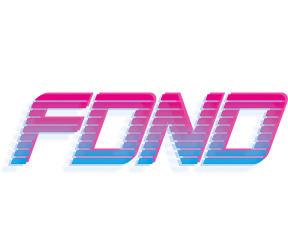
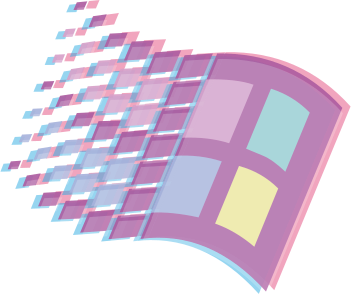
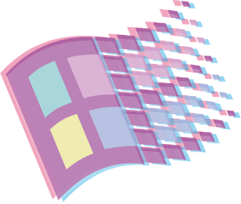

> Fork deze leertaak en ga aan de slag. Onderstaande outline ga je gedurende deze taak in jouw eigen GitHub omgeving uitwerken. De instructie vind je in: [docs/INSTRUCTIONS.md](docs/INSTRUCTIONS.md)

# Vaporwave Squad Page

## Description

<!-- Voeg een link toe naar Github Pages 🌐-->

https://vaporwave.student.fdnd.nl/

<!-- Voeg een mooie poster visual toe 📸 -->


The Vaporwave website is made with HTML, CSS & JS (also in JSON).
In this website we will show all the students in Front-end Development & Design.

The team consists of 5 developers/designers:

- Chaan Soekana
- Shauri Maigua
- Abdurabi Abukar
- Nandita Badeloe
- Justin Lung

## Table of contents

- [Description](#description)
- [Analyse](#analyse)
- [Design](#design)
- [Build](#build)
- [Integrate](#integrate)
- [Test](#test)
- [Liscence](#liscence)

## Analyse

As a team, we discussed which theme we should choose for our project.
In this process we decided to go with the Vaporwave theme.

For our first sprint, we had 2 weeks to integrate the developer life cycle.
This life cycle consists of:

- Analyse
- Design
- Build
- Integrate
- Test

## Design

As a team we made a few desgins. Each team member made a sketch of the website with pen & paper.

This sketch was made by Justin. This was a design for the smaller screens like mobile, tablet or laptop.


This sketch was made by Abdurabi. This was one of the first sketches to showcase our project, but this was a part of the development life cycle.


This sketch was made by Shauri. This was one of the first sketches to showcase our project, but this was a part of the development life cycle.


This sketch was made by Chaan. This sketch was made of the content of the website.


We came to a conclusion, to make a vaporwave themed website where we present our website. We will make this in HTML, CSS & JS


## Build

We made a Github repository and made issues for the enhancement of the website. We assigned every issue to a team member.

First we made our HTML file. This file contains our sections for our website. We made our HTML semantic. We used elements to make the document more clear.

```
   <main>
        <section id="home">
            <div class="overlay"></div>
            <div class="stars"></div>
            <div class="background-80s animated-clouds stars" style="--background-height:100vh"></div>
            
            <h1>【 w e l c o m e &nbsp; t o &nbsp; o u r &nbsp; s q u a d p a g e 】</h1>
            <div class="grid-container">
                <div class="grid" style="--grid-color:rgba(255, 255, 255, 0.5);--grid-size:30px;--grid-blur:1px;"></div>
            </div>
            <button class="navBtn"><a href="#about">Scroll Down</a></button>
        </section>

        <section id="about">
            <h2>[ a b o u t &nbsp; u s ]</h2>
            <p>
                Bij de Ad Frontend Design & Development doe je alles met code: met
                code los je een parkeerprobleem op voor de Gemeente Amsterdam, ontwerp
                je voor het systeem van de Openbare Bibliotheek een betere
                zoekfunctie, en help je samen met de verpleegkundigen van het
                Amsterdam UMC de zorg te verbeteren. Je richt je tijdens deze
                tweejarige studie op webdesign, visual interface design en frontend
                development. Vanaf het begin van de opleiding werk je aan actuele
                opdrachten van échte opdrachtgevers, en leer je samenwerken in
                multidisciplinaire teams.
            </p>

            <div class="windows-logo-container">
                
                
            </div>
        </section>

        <section id="squad">
            <h2>[ m e e t &nbsp; t h e &nbsp; s q u a d ]</h2>
            <div class="squad-container"></div>
        </section>
    </main>
```

Next we made the css of the website. We used different classes & id's to make this possible.

The home section was made in css animations. The grid moves in keyframe animations.

```
#home {
  background: linear-gradient(to bottom, #010310 0, #0c1142 20%, #45125e 45%, #d53567 59%, #f0c3d9 50%, #0c1142 60%);
  background-size: 100% var(--background-height, 100vh);
  position: relative;
  height: 100vh;

  display: flex;
  flex-direction: column;
  align-items: center;
}

#home h1 {
  color: #fff;
  font-size: .9rem;
  text-align: center;
  margin: 1em auto;
  font-family: 'Open Sans', 'Helvetica Neue', sans-serif;
  font-weight: 300;
  animation: intro-animation 2s cubic-bezier(0.175, 0.885, 0.32, 1.275);
  pointer-events: none;
}
```

Next we created our own JSON object where we save all the students from FDND. This will be imported in the main.js file to itterate and display the students in an alphabetical order.

```
export default [
    {
        "name": "Justin",
        "link": "https://justin.student.fdnd.nl/",
        "foto": "./assets/students/justin.JPG"
    },
```


Not only did we learn about HTML, CSS & JS, but we also learned to communicate with each other and make a better team. 
The rest of the code will be in our repository!

## Integrate
Every part we build for our website, we integrated it to Github. You can think of every change we made feature branches, committed our changes to the branche and pushed our commits to the branch. After the commits, we will merge it in the main branche. After that we hosted our website through Github pages. The link is https://vaporwave.student.fdnd.nl/

## Test
For the tests, we did some research on:

- Responsiveness
- Load times
- Different browsers/devices
- Usability 
- Icons loading

We documented this while another user is using our website.


Overall, there were some issues and bugs that needed to be fixed. The major bugs are fixed (those were the responsiveness bugs & images not loading correctly on the site).

Other features or enhancements will be released on a later date.

## Liscence


This work is licensed under [GNU GPLv3](./LICENSE).
